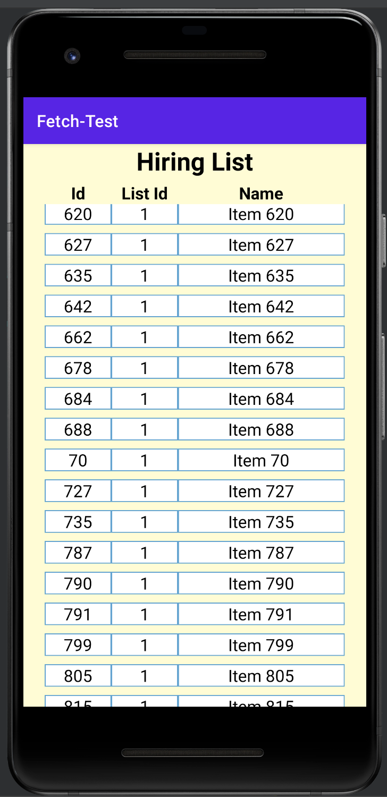

# Fetch-Android-Test
The app is used to display a list of data from hiring.json. The app ensures that all data is grouped by "listId" and sorted first in "listId" then by "name" when displaying. Additionally, the app implements a filtering mechanism that automatically removes any items with blank or null "name" fields, ensuring that only relevant and accurate data is displayed.

# User Interface
The list can be scrolled up and down.

# Technical Specifications
 - Android SDK: 30 (release: 11)
 - Android Studio 2022.1.1
 - Android Gradle Plugin Version 7.4.1
 - Gradle Version 7.5
 - Emulator used when developing: Pixel 2 API 30, Pixel 6 Pro API 33
 
# Installation Process
    - Android device:
        1. Enable unknown sources for the device.
        2. Locate "app.apk" file on your device and tap on it to start the installation process.
        3. Once the installation is completed, you should be able to launch the app.

    - Android Studio:
        1. Clone this repo.
        2. Open "FetchTest" directory in Android Studio.
        3. Sync Gradle and run emulator.

# User Guide
Users can scroll up and down to see the list sorted by "listId" in ascending order and "name" in lexicographical order.
